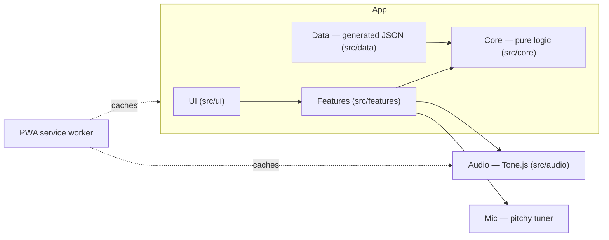

<p align="center">
  
</p>

# Atelier Six

A guitar chord-transition trainer: it works out the easiest fingering for every change, then
drills you on the hard ones.

[](https://github.com/WIPNHPT1/atelier-six/actions/workflows/ci.yml)
[](https://app.netlify.com/sites/ateliersix/deploys)
[](lighthouserc.json)
[](lighthouserc.json)
[](lighthouserc.json)
[](LICENSE)
[](tsconfig.app.json)

**[Live demo → ateliersix.netlify.app](https://ateliersix.netlify.app)** ·
[How it's built](https://ateliersix.netlify.app/about)

## Why

Chords are easy; changes are hard. Any chart shows you where to put your fingers for one
shape, but nothing shows you how to get from that shape to the next one without a gap in the
music. Atelier Six plans every change — which fingers stay, which slide, which lift — and then
trains exactly the changes you find hardest.

## Features

- **Transition engine** — picks fingerings for a whole progression at once, not chord by chord.
- **Guided course** — short lessons built from genre style sheets, with a live tab lane and a
  realistic backing band.
- **Change cards** — plain-English instructions for every change ("keep finger 3, slide 1").
- **Drills** — one-minute change drills that target your slowest transitions.
- **Tuner** — in-browser microphone tuner; nothing leaves your device.
- **Progress** — heatmap and change history, stored locally; export and import as a file.
- **Installable PWA** — works fully offline once installed, including sounds.
- **Accessible** — keyboard-first, ⌘K command palette, reduced-motion support, light and dark.

## How the transition engine works

1. Every chord has several possible shapes (open, barre, up the neck).
2. For each pair of shapes, each finger's move is classified: anchor, guide, lift, place.
3. Each move has a cost; fingers moving together as a group are cheaper.
4. A Viterbi-style dynamic program picks the cheapest path of shapes through the progression.
5. The result is scored and explained in plain English on each change card.

Full write-up with the cost tables: [docs/engine.md](docs/engine.md).

## Architecture



More detail: [docs/architecture.md](docs/architecture.md) and the decision records in
[docs/adr](docs/adr/0001-record-architecture-decisions.md).

## Tech stack

| Tool                | Why                                                                  |
| ------------------- | -------------------------------------------------------------------- |
| Vite + React 19     | Fast dev loop, lazy routes, a small entry bundle.                    |
| TypeScript (strict) | The engine is maths-heavy; strict types catch index and null errors. |
| Tone.js             | Sample playback and sample-accurate scheduling on Web Audio.         |
| pitchy              | Small, accurate pitch detection for the tuner.                       |
| Motion              | Spring animations that respect reduced motion.                       |
| Zustand             | Tiny stores for settings, playback and progress.                     |
| idb-keyval          | Progress stored in IndexedDB, on the device only.                    |
| vite-plugin-pwa     | Service worker, offline caching and install prompt.                  |
| Vitest + Playwright | Unit tests for core, end-to-end tests on phone, tablet and desktop.  |
| Lighthouse CI + axe | Performance and accessibility checked on every CI run.               |
| Netlify via GitHub  | Every push to `main` deploys; no server to run.                      |

## Quality

- **100% unit-test coverage of `src/core`** (the engine, schedules, lessons, progress).
- **End-to-end tests** in Playwright on 3 viewports (phone, tablet, desktop) across Chromium,
  WebKit and Firefox, plus visual regression snapshots.
- **Lighthouse**: performance 81, accessibility 98, best practices 100.
- **Accessibility**: axe scans on every route; 4.5:1 contrast checked from the design tokens.
- **Size budgets**: entry JS 113 KB gzip (budget 200 KB), entry CSS 48.5 KB gzip.
- **Frame time**: 16.61 ms average during playback (60 fps).

## Getting started

Needs Node.js 24.

```bash
npm i
npm run dev
```

| Script                 | What it does                                   |
| ---------------------- | ---------------------------------------------- |
| `npm run dev`          | Start the dev server.                          |
| `npm run build`        | Style lint, typecheck and production build.    |
| `npm run preview`      | Serve the production build locally.            |
| `npm run verify`       | Lint + typecheck + unit tests.                 |
| `npm run e2e`          | Playwright end-to-end tests.                   |
| `npm run size`         | Check bundle size budgets.                     |
| `npm run lint:style`   | Check every lesson against its style sheet.    |
| `npm run data:chords`  | Regenerate chord shape data.                   |
| `npm run data:lessons` | Regenerate lesson data.                        |
| `npm run check:links`  | Check that every link in this README resolves. |

See [CONTRIBUTING.md](CONTRIBUTING.md) for the full workflow.

## Project structure

```text
src/
  app/        app shell, routes, settings store, PWA toasts
  audio/      Tone.js engine, playback, samples, mic
  content/    all user-facing wording (en-GB)
  core/       pure logic: engine, schedule, lessons, progress, theory
  data/       generated chord, lesson and style data
  features/   one folder per screen (lesson, drills, tuner, about…)
  styles/     design tokens and finishes
  ui/         design-system components
scripts/      data generation, size and style checks
tests/e2e/    Playwright specs
docs/         engine write-up, architecture, ADRs
```

## Roadmap

- **v1.0** — two course modules, transition engine, tuner, drills, PWA.
- **v1.1** — three more modules, lead notation, simulated Whammy with MIDI pedal support.
- **v1.2** — in-browser chord detection, auto-advance, mic-based adaptive tempo.
- **v2.0** — optional sync, desktop studio, style morph, backing-band jam mode.
- **v2.x** — camera finger check, app-store builds.

## Licence

MIT — see [LICENSE](LICENSE). Sample and font licences: [docs/licences.md](docs/licences.md).

## Acknowledgements

Built on [Tone.js](https://tonejs.github.io/), [pitchy](https://github.com/ianprime0509/pitchy)
and the Geist, Geist Mono and Instrument Serif fonts. Lessons are described by genre only; no
songs or artists are named, and no song tabs or lyrics are included. Atelier Six is not
affiliated with or endorsed by any guitar maker, artist or label.
