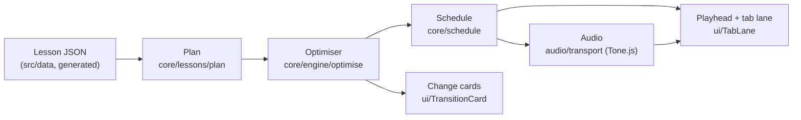

# Architecture

Atelier Six is a single-page PWA with no backend. Everything — the engine, the lessons, the
audio and your progress — runs and stays in the browser.

## Data flow

1. **Lesson JSON.** Lessons, chord shapes and tunes are generated by scripts in
   `scripts/data/` from each module's style sheet (`src/data/styles`). They are checked for
   playability, harmony, bar length and style (`npm run lint:style`) before they are written.
2. **Plan.** `planSection` turns a lesson section into chord names, a rhythm preset and
   candidate shapes.
3. **Optimiser.** `optimise` picks one shape per chord for the whole section with a
   Viterbi-style dynamic program over the candidate lattice (see [engine.md](engine.md)).
4. **Schedule.** `buildSchedule` turns shapes + rhythm into timed events (strums, mutes,
   clicks, drums); `humanise` adds seeded timing and velocity variation.
5. **Audio and playhead.** `audio/transport` hands the events to `Tone.Part`s. The UI reads
   the audible time (`getSecondsAtTime(currentTime − output latency)`) to light the active tab
   column, so what you see matches what you hear.

## Why the core is pure

`src/core` imports no DOM, audio or React code. That keeps the maths fast to test (100%
coverage, run in milliseconds under Vitest), deterministic (seeded randomness only), and
reusable from both the app and the Node data scripts. Tone.js is loaded lazily and never
reaches the entry chunk (checked by `npm run size`).

## State stores

| Store                           | Holds                                 | Persisted    |
| ------------------------------- | ------------------------------------- | ------------ |
| `app/settingsStore`             | mode, finish, motion, tuning, capo…   | localStorage |
| `audio/playbackStore`           | what's playing, tempo, loop, position | no           |
| `features/progress/store`       | attempts, change history, heatmap     | IndexedDB    |
| `ui/shortcuts/shortcutRegistry` | active keyboard shortcuts             | no           |
| `ui/brassSheen/tiltStore`       | device tilt for the sheen effect      | no           |

All stores are Zustand; components select one primitive at a time (or use `useShallow`).

## Offline strategy

- The service worker (vite-plugin-pwa, Workbox) precaches the whole build: JS, CSS, fonts,
  icons and data. Deep links fall back to `index.html`.
- Instrument samples are large and opt-in, so they are not precached. A cache-first runtime
  rule (`a6-audio-v1`) keeps each sample once it has been played, and "Download sounds for
  offline" in Settings fetches them all into the same cache.
- Updates install automatically; a toast offers a reload when a new version is ready.

## Decisions

See the ADRs in [docs/adr](adr/0001-record-architecture-decisions.md).
