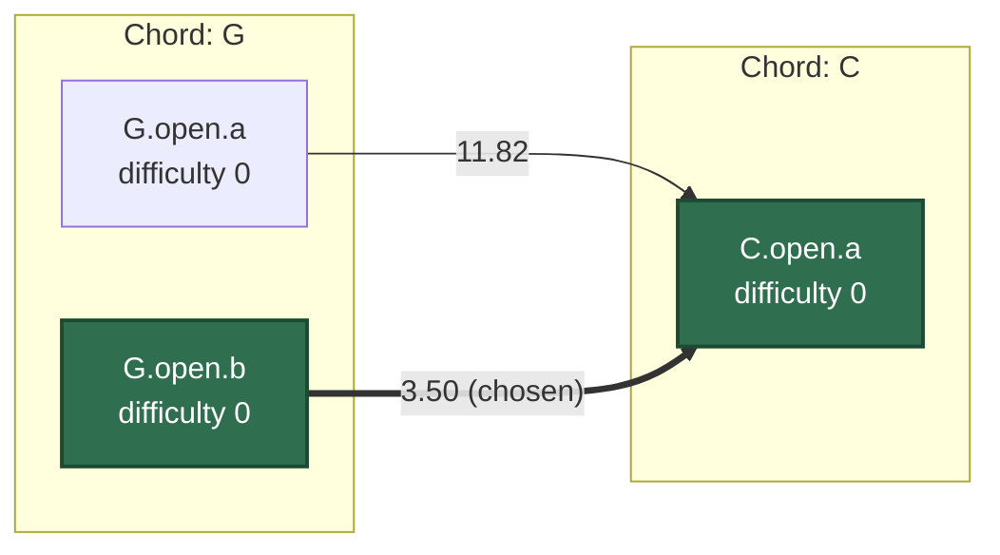

# The transition engine

`src/core/engine` picks the fingering for each chord in a progression, and scores how hard it
is to move between them. Pure logic, no DOM or audio — see `src/core/engine/*.test.ts` for the
numbers used below.

## The problem

Any single chord shape is easy — look up a diagram, place your fingers. What makes a
progression hard or easy is the **transition** between shapes: which fingers can stay put,
which have to slide, and which have to lift off and land somewhere new. The same chord can be
fretted several different ways (open, barre, up the neck), and the "best" fingering for a chord
in isolation is often the wrong one once you know what comes next. The engine picks fingerings
for a whole progression at once, trading a chord's own difficulty against the cost of getting
into and out of it.

## Move taxonomy

For each real finger (1–4, T) the engine compares its position in shape A and shape B and
classifies the move. `dString`/`dFret` are the differences in string index and fret between the
two positions.

| Type      | Condition                                     | Cost                               |
| --------- | --------------------------------------------- | ---------------------------------- |
| `anchor`  | same string, same fret (vector `(0,0)`)       | 0                                  |
| `guide`   | same string, different fret (`dString = 0`)   | `1 + 0.25·⏐dFret⏐`                 |
| `lift`    | different string (`dString ≠ 0`)              | `3 + 0.3·√(dString² + dFret²)`     |
| `place`   | finger absent from A, present in B            | 2                                  |
| `release` | finger present in A, absent from B            | 0                                  |
| `group`   | ≥2 fingers share an identical non-zero vector | 0 (its cost is the group's, below) |

A finger that doesn't appear in either shape produces no move at all.

## Grouping

Guitarists don't move fingers one at a time when several travel together — a two-finger power
chord sliding up two frets is one motion, not two independent lifts. `analyseTransition` looks
for ≥2 fingers sharing the exact same `(dString, dFret)` vector and merges them into a `Group`:

- `dString = 0` → **slide** (same strings, new fret) — cost `1 + 0.2·⏐dFret⏐`
- `dString ≠ 0` → **shift** (new strings) — cost `1.5 + 0.25·⏐dFret⏐`

Anchors (vector `(0,0)`) are never grouped. If two different vectors each have ≥2 fingers, they
become two separate groups, ordered by their lowest finger number for determinism. Grouped
moves get `type: 'group'` and a `groupIndex`; their individual move cost becomes 0 since the
group is costed once.

## Cost model

`transitionCost(transition)` sums every ungrouped move's cost plus every group's cost, then
rounds to 2 dp for display. `shapeDifficulty(shape)` scores a shape on its own:

```
2 · max(0, span − 3)        // span = highest − lowest fretted fret, ignoring open strings
+ 2   if the shape is barred
+ 1   if it uses the thumb
+ 0.5 per interior muted string (muted, with a sounding string on both sides)
```

All the numbers above live in one exported `WEIGHTS` object in `src/core/engine/cost.ts` — tune
the practice difficulty curve by editing that object, not by hunting through the code.

## Why Viterbi

Picking a fingering for chord _i_ depends on which fingering was picked for chord _i-1_ (that's
where the transition cost comes from), so the choices can't be made independently. This is the
same shape as decoding a sequence of hidden states from noisy observations in speech
recognition: a lattice of candidates per time step, with a cost on every edge between
consecutive steps, and a cheapest path through the whole lattice. The Viterbi algorithm solves
that with dynamic programming instead of trying every combination:

```
cost[i][k] = shapeDifficulty(k) + min_j ( cost[i-1][j] + transitionCost(j → k) )
```

`optimise()` builds this up column by column, keeping the running cost and the path that
produced it for every candidate shape, so no shape's full history is ever recomputed.

### Lattice example: G → C



`G.open.a` and `G.open.b` fret the same notes, so both have `shapeDifficulty` 0 — the choice
comes down entirely to the transition. `G.open.a → C.open.a` classifies as three independent
lifts (fingers 1, 2, 3 all change strings on different vectors, so nothing groups), costing
**11.82**. `G.open.b → C.open.a` is a shift group on fingers {2, 3} (`1.5 + 0.25·0 = 1.5`) plus a
`place` for finger 1 (2) and a free `release` for finger 4 (0), costing **3.50**. `optimise`
picks `G.open.b`, matching `src/core/engine/optimise.test.ts`.

## Loop handling

A practice loop (last chord back to the first) needs a closing transition, but the DP as
described only optimises a line, not a cycle. `optimise({ loop: true })` works around this by
trying every candidate of chord 0 as a **fixed** starting point, running the ordinary DP for the
rest of the progression, then adding the cost of the closing transition back to that starting
shape. The cheapest of those `|candidates[0]|` runs wins. This is O(k₀) DP passes instead of one,
but the complexity guard (below) keeps that bounded.

## Determinism

Every tie — between two predecessor shapes with equal cost, between two final shapes, between
two loop-starting shapes — is broken by comparing `shape.id` as a string and taking the lower
one. This makes `optimise` a pure function of its inputs: the same candidates in the same order
always produce the same result, which `optimise.test.ts` checks by running a loop 100 times.

## Complexity

The DP does O(k) work in a chord's own candidate count and, for each candidate, O(k_prev) work
comparing against the previous chord's candidates — O(n·k²) overall for an n-chord progression
with up to k candidates per chord. `optimise` throws if the total candidate count across all
chords exceeds 400, so callers should filter by tag or register with `candidatesFor` before
handing shapes to the optimiser rather than passing every shape in the library.

## Tuning the weights

`WEIGHTS` (in `cost.ts`) was chosen so an easy open-chord change (like C → Am, a single lift)
lands around 3.5–4, and a progression built entirely from movable shapes that slide or shift as
one unit comes out cheaper than the same progression fingered independently per string. The
`gentle` / `moderate` / `demanding` labels in `scoreProgression` (`< 4` / `< 7` / `≥ 7` average
transition cost) were picked against those reference points — raise or lower the move/group base
costs to shift the whole curve, or the per-fret multipliers to change how much distance matters
relative to the type of move.

## See also

- `src/core/engine/classifyMoves.ts` — per-finger move classification
- `src/core/engine/analyseTransition.ts` — grouping
- `src/core/engine/cost.ts` — `WEIGHTS`, `transitionCost`, `shapeDifficulty`
- `src/core/engine/optimise.ts` — the Viterbi DP and loop handling
- `src/core/engine/score.ts` — `scoreProgression` and the gentle/moderate/demanding labels
